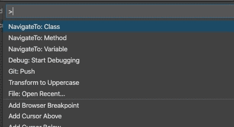

# navigateto README

VSCode extension that allows you to quickly find classes, methods, functions or variables in Python or JavaScript (including react jsx).

This is available through symbol search in vscode, but (depending a bit on the language server/support) it is not as fine grained. I missed this from another IDE, and perhaps someone else will find it useful too.

## Features

* Easily lookup of classes, methods, functions and variables. You search for one of them at a time, and when you select a match the file is opened on the line of the definition of your match.
* Supports multiple workspace folders (e.g. workspaces). We only index files within a workspace, but the workspace can have as many folders as you like.
* Shows a preview of the definition (unless it is too long) as you search.
* Fast - uses [tree-sitter](https://tree-sitter.github.io/tree-sitter/) via [node-tree-sitter](https://github.com/tree-sitter/node-tree-sitter), and tree sitter is used by Atom to parse code for syntax hilighting etc., so it is fast and well supported.
* The index is built on your first search (not on load), or if you run the `NavigateTo: Rebuild index` command palette command. So it has no performance impact on startup times or if you use it infrequently.

## Extension Settings

This extension contributes the following settings:

* `navigateTo.ignore`: An array of .gitignore compatible ignore patterns. Just like you would add to .gitignore, but one pattern per entry in the array (instead of one per line as in .gitignore). All patterns are relative to the root of the workspace directory (the directory with .vscode/ as a subdirectory).
* `navigateTo.ignoreFileNames`: An array of filenames to look in for gitignore patterns. Defaults to `[".gitignore"]`, and that is probably what you want in most cases. ONLY files in the root of the workspace directory (the directory with .vscode/ as a subdirectory) is checked. So adding a file that you have in a subdirectory will not help here.
* `navigateTo.exclude`: Simple glob exclude pattern. Defaults to `*/{node_modules,.git}/**`.
* `navigateTo.updateIndexOnSave`: Update the search index when a file is saved? Defaults to `true`. Note that the update is cheap - it only re-parses the file you are saving (and tree-sitter is fast and efficient).

### Order of applying ignore/exclude settings
(How we find files to include in the search index)

1. We search the workspace folders for folder in the workspace, and only include files that match a supported extension. This is `*.py`, `*.js` and `*.jsx`.
2. Files are excluded by `navigateTo.exclude`.
3. We build an ignore configuration by reading ignore patterns from all the files in `navigateTo.ignoreFileNames` (e.g. from .gitignore by default), and then we add ignore patterns from the `navigateTo.ignore` setting.

## Available command palette commands

The actual command is within `[]` below - useful if you want to setup keybindings.

- **NavigateTo: Class** `[navigateto.navigateToClass]`. Find and navigate to a class.
- **NavigateTo: Method** `[navigateto.navigateToMethod]`. Find and navigate to a method (a function WITHIN a class).
- **NavigateTo: Function** `[navigateto.navigateToFunction]`. Find and navigate to a function (a function NOT within a class).
- **NavigateTo: Variable** `[navigateto.navigateToVariable]`. Find and navigate to a variable.
- **NavigateTo: Any** `[navigateto.navigateToAny]`. Find and navigate to a class, method, function or variable.
- **NavigateTo: Rebuild index** `[navigateto.rebuildIndex]`. Rebuild the index. Rarely needed since we build the index when you first search for something, and update it when you save, rename or delete a file.

## Adding support for more languages
See the parsers for javascript and python in `src/parsers/`. As long as there is a tree-sitter language definition available, and the language is not too disimilar from python or javascript, adding support for more languages should be easy. We may have to extend/change the base class for parsers to make it possible to include some languages. You will probably want to read DEVELOP.md if you plan on adding support for more languages.

Get in contact via submitting an issue or pull request on the github repository (https://github.com/appressoas/vscode-navigate-to) if you want to add support for more languages. We will not accept pull requests without tests.

We are considering adding a way to add extra language support in separate extensions. Add an issue, with a suggested solution or at least a willingness to be a beta tester of this functionality, if you want this.

## Release Notes

Users appreciate release notes as you update your extension.

### 1.0.0

Initial release of vscode-navigate-to.
